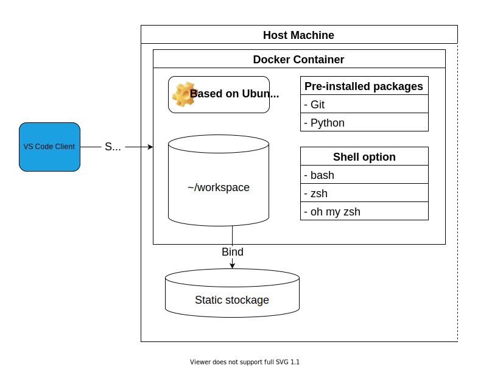

# VSCode-Server-Docker

Intégration de [Visual Studio Code Server](https://code.visualstudio.com/docs/remote/vscode-server) et de [Ubuntu](https://hub.docker.com/_/ubuntu) dans un container Docker prêt a l'usage pour du développement à distance via ssh.

- La connection se fait en root avec une clé SSH.
- L'espace de Travail se trouve dans /root/workspace/, ce stockage est relié à un dossier sur la machine host.



## Installation

```docker
docker run -p 22:22000 \
  --mount type=bind, source=/path/to/workspace, target=/root/workspace \
  --mount type=bind, source=/path/to/autorized_keys, target=/root/.ssh/autorized_keys \
  marty42/vscode-ssh-server
```
